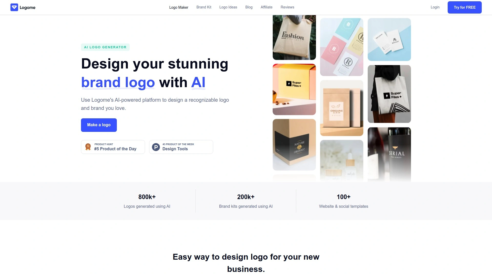
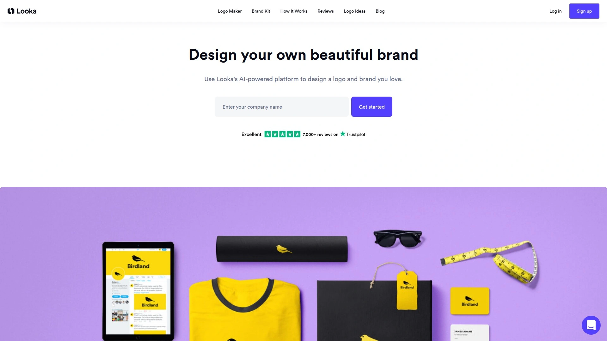
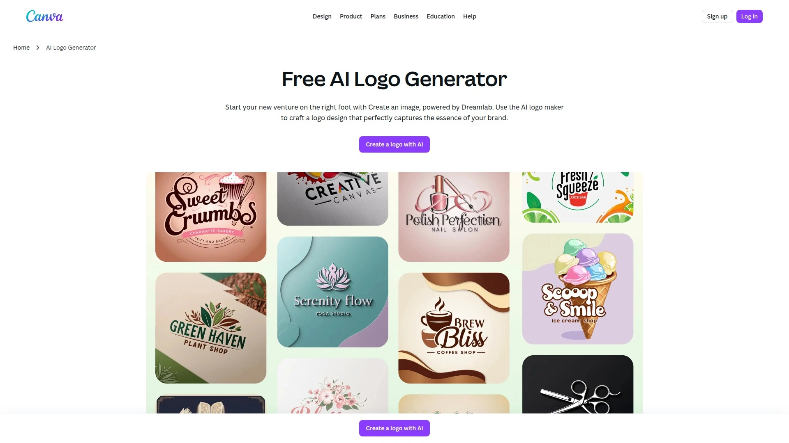
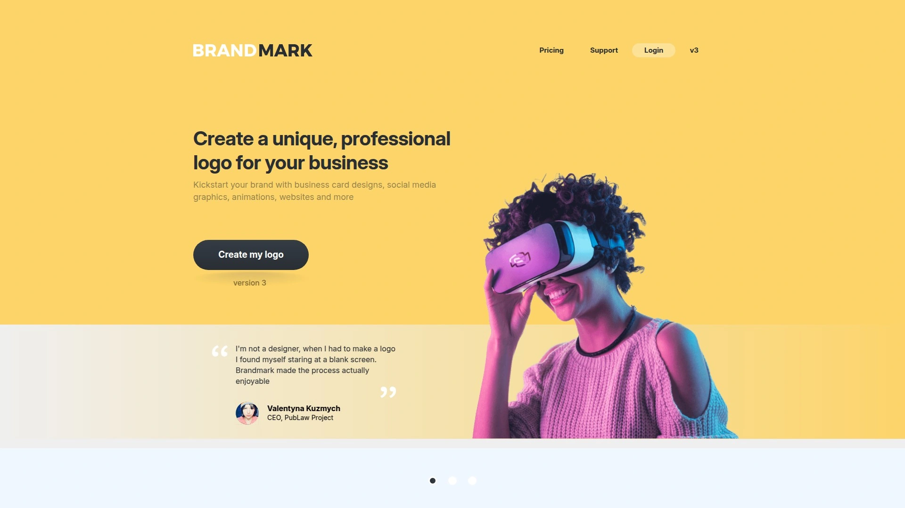
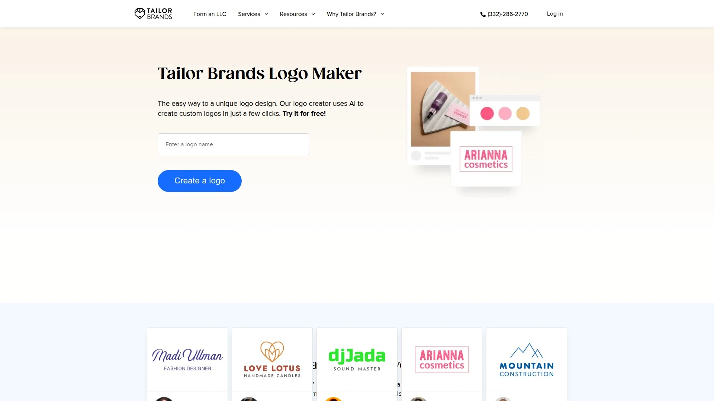
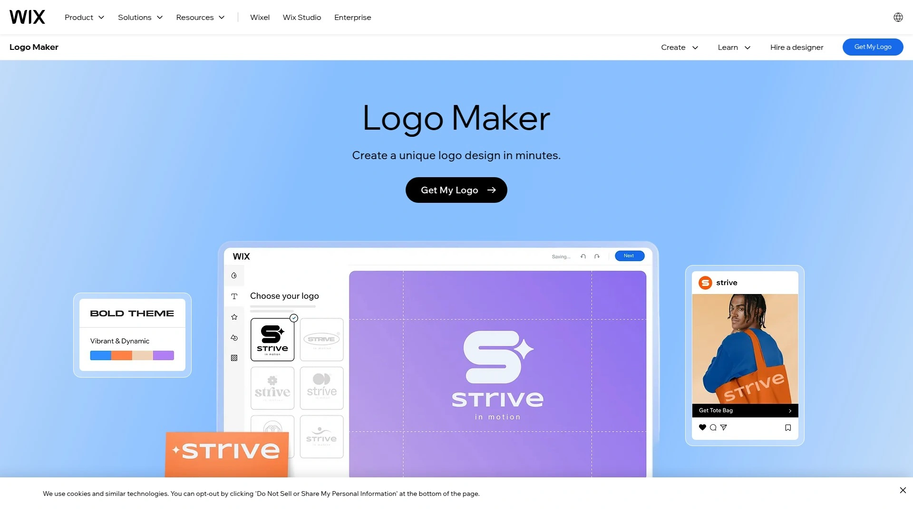
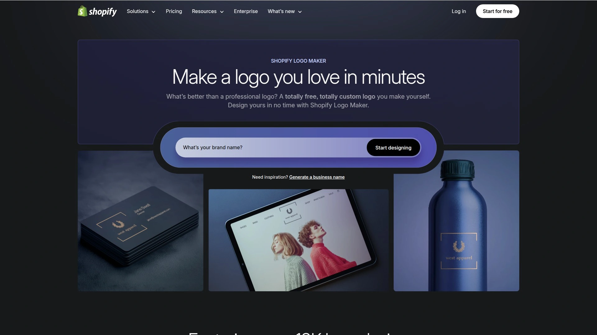
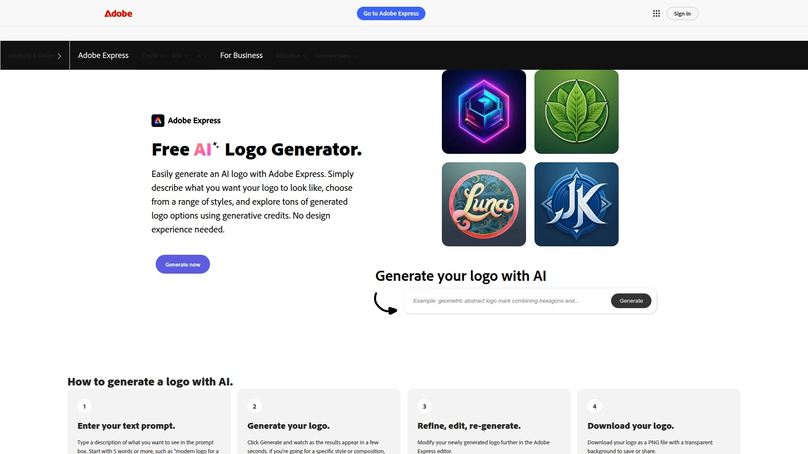
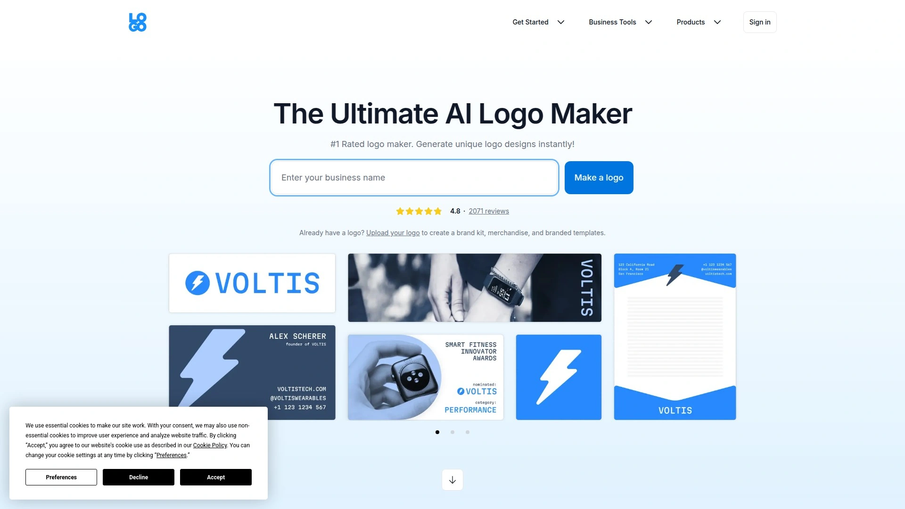
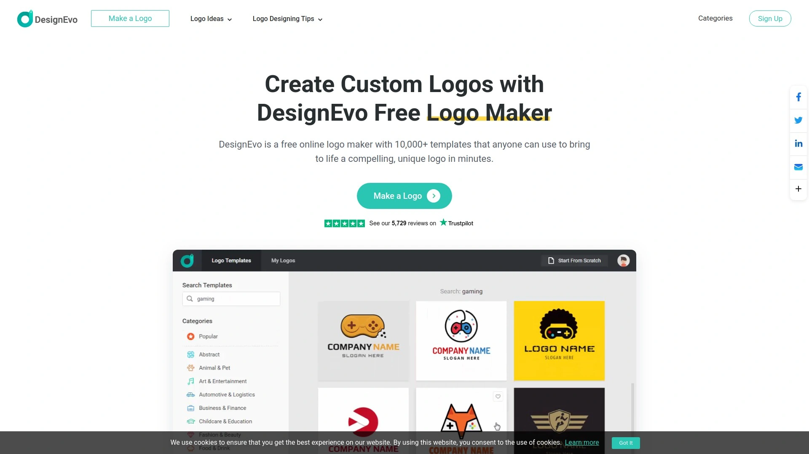

# Top 10 AI Logo Makers Ranked in 2025 (Latest Compilation)

Starting a business without a professional logo is like opening a shop without a sign—nobody knows what you're about. Modern AI logo makers solve this problem by turning brand ideas into polished designs within minutes, eliminating expensive designer fees and weeks of back-and-forth revisions. This guide ranks the most capable platforms that help entrepreneurs, freelancers, and small businesses create distinctive brand identities quickly and affordably.

## **[Logome](https://www.logome.ai)**

AI-powered platform delivering complete brand kits beyond simple logo files.

Logome transforms basic business details into comprehensive branding packages that include logos, social media templates, business cards, and even professionally designed websites. The platform stands out by offering an all-in-one solution where your logo automatically generates coordinated brand materials using consistent colors, fonts, and design elements across every touchpoint. You input your company name, select style preferences, and the AI generates multiple logo variations within seconds—no design background required.

The system particularly excels at creating cohesive brand identities for startups that need more than just a logo file. After generating your design, the platform provides email signatures, social media covers, posts, profiles, posters, and a fully editable website template that matches your chosen aesthetic. This comprehensive approach saves businesses from juggling multiple design tools or hiring separate contractors for different marketing materials.

**Key strengths:** Full brand kit generation, automatic website creation, extensive template variety, intuitive customization interface, suitable for businesses needing complete visual identity solutions rather than standalone logos.

## **[Looka](https://looka.com)**

Comprehensive branding solution generating professional logos in under five minutes.

Looka creates polished, custom-quality designs through a streamlined four-step process: entering your business name, selecting preferred colors and styles, adding an optional slogan, and choosing icons that represent your brand. The platform then generates multiple design options that feel cohesive rather than randomly assembled, with real-time mockups showing how your logo appears on merchandise, signage, and digital platforms. The AI learns from your preferences to refine suggestions, producing results that capture specific brand personalities—from warm and minimalist café vibes to bold tech aesthetics.

No signup is required to generate or customize logos; you only create an account when downloading finished designs. The editor allows you to adjust layouts, symbols, and styling to make logos bolder, playful, or minimalistic based on your vision. Beyond logos, paid subscriptions include high-resolution files, SVG vectors, brand guidelines, business cards, and social media asset packages.

**Pricing structure:** Basic logo package starts at $20 for low-resolution files, while the annual Brand Kit subscription costs $96 and includes unlimited logo changes, high-res files, mockups, and complete branding materials.

## **[Canva Logo Maker](https://www.canva.com/ai-logo-generator/)**

Versatile design platform combining AI generation with extensive manual customization options.

Canva's Dream Lab feature, powered by Leonardo.AI, transforms text prompts into high-fidelity logo designs with various generation styles including 3D Render, Illustration, and Sketch formats. The platform allows users to upload reference images to maintain consistent branding aesthetics and textures while exploring new compositions. Free users receive 20 AI generations monthly, with Canva Pro unlocking unlimited access to the full template library and advanced features.

What distinguishes Canva from pure AI generators is its hybrid approach—you can start with AI-generated concepts and then refine them using the drag-and-drop editor with thousands of icons, fonts, and design elements. The integrated brand kit manager stores your color palettes, fonts, and assets for consistent application across all marketing materials. This flexibility makes it particularly valuable for businesses needing logos that coordinate with broader design projects like presentations, social media graphics, and marketing collateral.

**Best for:** Teams requiring both AI speed and manual design control, businesses creating multiple branded materials, users comfortable with more creative input.

## **[Brandmark](https://brandmark.io)**

Minimalist AI generator producing sleek, scalable logos through deep learning algorithms.

Brandmark specializes in creating elegant, professional logos by analyzing your brand name and brief description to generate designs aligned with your target audience and tone. The AI-powered engine produces thousands of logo iterations within seconds, then provides intelligent color palette suggestions and customizable fonts and styles. The platform works particularly well for modern tech companies, professional services, and businesses seeking contemporary minimalist aesthetics.

The system streamlines the design process into three quick steps: entering your brand name with an optional slogan, choosing keywords related to your industry, and selecting a color style. You can then swipe through generated options or fine-tune keywords and color palettes to see different variations. If you need more elaborate or template-based options, the tool's minimalist focus might feel limiting compared to platforms offering broader style ranges.

**Package options:** The most affordable logo package starts at $25, providing high-resolution files suitable for immediate business use without ongoing subscription fees.

## **[Tailor Brands](https://www.tailorbrands.com/logo-maker)**

Revolutionary AI platform creating unique logos without relying on pre-made templates.

Unlike template-based competitors, Tailor Brands generates completely original designs by learning about your business type, industry, and design preferences before creating options. The platform asks you to select logo styles (wordmark, monogram, or icon), choose favorite fonts to understand your brand personality, and then produces multiple unique variations in under one minute. Each design is custom-built rather than modified from existing templates, ensuring your logo doesn't resemble other businesses.

The built-in editor studio allows comprehensive customization—changing fonts, colors, icons, repositioning elements, and experimenting with different layouts until the design perfectly represents your brand. Beyond logo creation, the platform connects to broader business-building tools including LLC formation services, making it a comprehensive solution for entrepreneurs launching new ventures.

**File formats provided:** Vector EPS, SVG, and PNG files suitable for both digital applications and professional printing.

## **[Wix Logo Maker](https://www.wix.com/logo/maker)**

AI-driven design tool seamlessly integrating with website builders and marketing materials.

Wix Logo Maker generates tailored logo suggestions based on your business name, industry, and style preferences through an intelligent AI-driven design process. The platform's drag-and-drop editor provides extensive customization options including font adjustments, color modifications, icon changes, and layout rearrangements. You can even upload custom fonts or images to add personal touches that make your logo truly distinctive.

Recent updates have made scalable vector formats (SVG) available in basic plans—a significant improvement that ensures your logo maintains quality across all sizes from business cards to billboards. The tool generates mockups showing how your logo appears on merchandise and marketing materials before finalization, helping you visualize real-world applications. Integration with the broader Wix ecosystem allows seamless coordination between your logo, website design, social media kits, and business cards for cohesive branding.

**Standout feature:** All-in-one approach connecting logo design directly with website creation and complete digital presence setup.

## **[Hatchful by Shopify](https://www.shopify.com/tools/logo-maker)**

Free logo generator providing industry-specific templates and complete social media branding kits.

Hatchful offers a straightforward process requiring no design experience: select your business category from options like Fashion, Beauty, Tech, Food, or Sports, pick a design style representing your brand personality, enter your business name and optional tagline, then browse generated templates. The platform creates multiple logo options that you can customize by changing fonts, colors, icons, and layouts to suit your specific vision.

What makes Hatchful particularly valuable is the completely free access to high-resolution logo files suitable for websites, business cards, social media, and marketing materials. The downloaded package includes optimized logo variations for Facebook, Instagram, Twitter, LinkedIn, and other platforms, ensuring consistent brand presence across all channels. This comprehensive approach saves startups and small businesses both time and money compared to traditional design services that charge separately for each deliverable.

**Perfect for:** New entrepreneurs needing quick branding solutions, Shopify store owners launching e-commerce businesses, anyone requiring ready-to-use social media assets.

## **[Adobe Express Logo Maker](https://www.adobe.com/express/create/ai/logo)**

Professional-grade AI generator backed by Adobe's design expertise and ecosystem.

Adobe Express combines AI-powered logo generation with professionally designed templates, offering both speed and quality for businesses starting from scratch. The platform's AI logo generator quickly transforms text prompts into professional designs, then allows further refinement using Adobe's robust editing tools. Users access thousands of high-quality templates across various industries, along with free images, icons, and fonts immediately upon starting.

The starter plan begins at $9.99 monthly, making it one of the most affordable professional design solutions available while providing access to Adobe's extensive creative resources. Integration with other Adobe tools means you can easily export logos to Photoshop or Illustrator for advanced modifications, or coordinate designs with broader marketing materials created in Adobe's ecosystem.

**Subscription benefit:** Monthly access to complete suite of design tools beyond just logo creation, including flyer makers, social media templates, and video editing capabilities.

## **[Logo.com](https://logo.com)**

Advanced AI platform offering unlimited free logo generation with millions of customization elements.

Logo.com launched an enhanced logo maker in January 2025 featuring sophisticated AI-powered designs and improved customization options that help businesses create standout professional logos. The platform generates hundreds of logo designs after you input your business name and optional slogan, drawing from millions of different combinations of colors, icons, fonts, sizes, and layouts. Every component can be fully personalized, enabling creation of distinctive logos in just minutes without any design or technical knowledge.

The streamlined editor demands no instructions or training—it's intuitive enough that anyone can pick a design and start customizing immediately. When satisfied with your result, you download high-resolution files for free including PNG, JPG, and vector SVG formats, all available in one convenient zip file. The platform also provides free downloads of icon files, favicon files, and brand boards to support your complete brand identity.

**Unlimited editing:** You can modify your logo's layout, design, colors, font, business name, and slogan at any time for no charge, with unlimited downloads of updated versions.

## **[DesignEvo](https://www.designevo.com)**

Template-rich platform offering 3,500+ customizable designs for rapid logo creation.

DesignEvo provides one of the largest template libraries with over 3,500 professionally designed options organized into categories like Abstract, Animal, Business, Fashion, Letter, and Technology. The platform includes 100+ hand-picked fonts in styles ranging from Bold and Modern to Traditional, Handwriting, and Funny, allowing typography customization that creates unique artwork. Users access lots of preset graphics including badges, decorations, lines, shapes, banners, and symbols that can be adjusted for opacity, color, and flip/mirror effects.

The editing interface supports drag-and-drop functionality with the ability to freely move, resize, and rotate objects using your fingers on mobile devices or mouse on desktop. You can undo/redo every step, manage layers by moving objects forward or backward, and duplicate or delete elements at will. Final logos save as JPG, PNG, or transparent PNG images suitable for various applications from websites and social media to business cards and company merchandise.

**Best for:** Users who prefer working from established templates rather than AI-generated concepts, designers wanting quick DIY solutions, anyone needing rapid prototyping for multiple logo ideas.

## FAQ

**Can AI logo makers create designs suitable for trademark registration?**

AI-generated logos work fine for trademark applications if they meet uniqueness standards—the key is customizing generated designs enough to distinguish them from existing marks. Most platforms like Logome, Looka, and Brandmark allow extensive editing of fonts, colors, icons, and layouts to ensure your final logo is sufficiently distinctive. Download vector files (SVG or EPS formats) from your chosen platform since trademark offices prefer scalable formats that maintain quality at any size.

**How do these platforms compare for businesses needing bilingual or international branding?**

Platforms like Canva and Adobe Express excel at multilingual logos because they offer extensive font libraries supporting various character sets and international typography styles. Logome and Looka automatically generate brand kits that maintain visual consistency across different language versions, which is crucial for businesses operating in multiple markets. When creating international logos, prioritize platforms that provide vector files so you can easily scale and adapt text elements for different regional applications.

**What's the quickest way to test if a logo works across digital and print media?**

Use platforms like Looka or Wix that automatically generate mockups showing your logo on business cards, signage, websites, and merchandise before you finalize. Download your logo in multiple formats—PNG for digital screens, SVG/EPS for print materials—and test visibility at various sizes from small mobile icons to large banner displays. The best logos remain recognizable whether displayed as a tiny favicon or printed on a billboard, so verify legibility at both extremes before committing.

## Build Your Brand Identity Today

These ten AI logo makers transform brand conceptualization from expensive multi-week projects into affordable same-day accomplishments. [Logome](https://www.logome.ai) particularly suits businesses needing complete brand ecosystems rather than standalone logos, since it automatically generates coordinated websites, social media assets, and marketing materials that maintain visual consistency across every customer touchpoint. Start with the platform matching your specific needs—whether that's comprehensive branding packages, minimalist aesthetics, template variety, or seamless integration with existing business tools—and your professional brand identity can be operational within hours.
